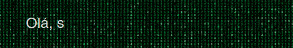
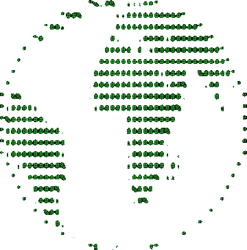
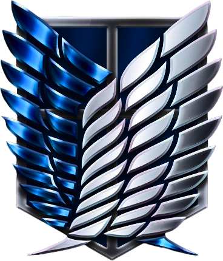

 
  

##

  
  
:recycle:&nbsp;Explorar, implementar e refatorar.

 

## Sobre Mim

  
  <ul align="left">
    <li>🎓 &nbsp; Desenvolvedor Web Full Stack pela <a href="https://www.betrybe.com/formacao-desenvolvimento-web">Trybe</a>.</li>
    <li>:thinking: &nbsp; Aprendendo mais sobre NestJS, Typescript e Docker.</li>
  </ul>

 
 

## Minhas Skills

**Stacks de Desenvolvimento**

  
  
  
  
  
  
  
  
  
  
  
  
  
**Testes**

  
  
  
**DevOps**

  
  
  
  <!--  -->

**Ferramentas de Desenvolvimento**

  
  
  
  
**Utilitários**

 
 
 
 
 

 

## GitHub Stats

  <a href="https://github.com/jmlinger">
  
  

 
  
  

    
  

    Shinzou wo sasageyo!
  

